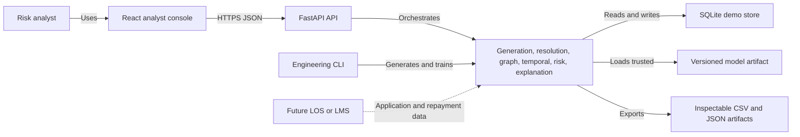

# TVS JaalDrishti

> Detect the network before it becomes the loss.

TVS JaalDrishti is an explainable ecosystem-risk intelligence layer for lending teams. It complements an existing loan-origination or loan-management system by resolving relationships between applicants, devices, accounts, dealers, and locations; measuring how those networks change over time; and returning a transparent risk score with evidence and a recommended human-review action.

The core proposition is simple:

> Individual Risk != Ecosystem Risk

## Problem

Traditional application checks evaluate one borrower at a time. Individually plausible applicants can therefore appear low risk while collectively sharing devices, repayment accounts, dealers, locations, and tightly concentrated submission windows. By the time repayment performance exposes the pattern, the loss may already be distributed across a connected ecosystem.

## Solution

JaalDrishti turns normalized application records into a temporal relationship graph and combines four evidence sources:

- deterministic entity resolution across customers, devices, accounts, dealers, and locations;
- graph intelligence such as linked applicants, component size, density, centrality, and communities;
- point-in-time temporal intelligence for velocity, bursts, growth, and recency; and
- versioned explainable rules with optional supervised-model probability.

The result is a bounded `0–100` ecosystem score, ranked evidence objects, and one of three analyst actions: standard processing, manual review, or enhanced verification. JaalDrishti is decision support; it does not execute a lending decision.

## What is included

- seeded synthetic generation with 5,000 normal applications and 100 suspicious ecosystems;
- exact relationship resolution and weighted customer projection;
- NetworkX graph features and deterministic community detection;
- leakage-safe rolling temporal features;
- explainable hybrid risk scoring;
- Random Forest, XGBoost, and Isolation Forest comparison;
- versioned FastAPI contracts with SQLite demo persistence;
- a responsive React, TypeScript, Tailwind, React Flow, and Recharts analyst console; and
- an isolated one-click LOW-to-HIGH emerging-risk demonstration.

Phases 0–9 are complete. Phase 10 release documentation, CI, and regression verification are complete; repository screenshots await an available in-app browser capture session.

## Architecture



Authoritative risk calculations stay in the backend. The browser is a typed visualization client and never reconstructs a score. See [System architecture](docs/architecture.md), [data model](docs/data-model.md), and [API contract](docs/api-contract.md).

## Quick start

### Prerequisites

- Python 3.11+
- Node.js 22.13+
- npm

### 1. Install and start the API

```bash
python3 -m venv .venv
.venv/bin/python -m pip install -e 'backend[ml-xgboost,test]'
.venv/bin/jaal-api --host 127.0.0.1 --port 8000
```

The service exposes:

- health: `http://127.0.0.1:8000/health`
- interactive OpenAPI: `http://127.0.0.1:8000/docs`
- OpenAPI JSON: `http://127.0.0.1:8000/openapi.json`

### 2. Populate the standard demo portfolio

In another terminal:

```bash
curl -X POST http://127.0.0.1:8000/api/v1/generate_demo_data \
  -H 'Content-Type: application/json' \
  -d '{
    "seed": 2026,
    "normal_application_count": 5000,
    "suspicious_ecosystem_count": 100,
    "replace_existing": true
  }'
```

The standard seed currently produces 5,588 applications. Counts are derived from generated ecosystem sizes rather than hardcoded in the product.

### 3. Start the analyst console

```bash
cd frontend
cp .env.example .env.local
npm install
npm run dev
```

Open `http://localhost:3000`. Set `NEXT_PUBLIC_API_BASE_URL` in `frontend/.env.local` when the API is hosted elsewhere.

## Demo walkthrough

### One-click emerging ecosystem

1. Open `/demo`.
2. Select **Presentation view** for the distraction-free judge experience.
3. Follow the five-stage application → relationship → network → risk → action path.
4. Select **Start Simulation**.
5. Observe Customer A score LOW as an isolated applicant.
6. Review the live processing trace, six-applicant shared-device and dealer network, and temporal burst.
7. Observe the recomputed HIGH score, ranked evidence, and human-authorized enhanced-verification action.

Each click creates a new in-memory scenario namespace. It does not require, replace, or mutate the active portfolio.

Use the [three-minute judge presentation guide](docs/judge-presentation-guide.md) for the exact talk track, process explanation, and likely Q&A.

### Portfolio investigation

With the standard seed-2026 portfolio:

- use `APP-S-005001` on `/investigate`;
- follow `CUS-S-005001` into `/network`;
- review the operational activity stream on `/`;
- inspect dealer concentration on `/dealers`; and
- filter risk, dealer, and temporal patterns on `/analytics`.

## Analyst routes

| Route | Purpose |
|---|---|
| `/` | Live application stream, relationship graph, intelligence queue, and portfolio snapshot |
| `/investigate` | Borrower profile, score, ranked evidence, and action |
| `/network` | Bounded interactive customer-device-account-dealer-location graph |
| `/dealers` | Dealer concentration table, risk indicators, exposure, and selected-dealer detail |
| `/analytics` | Portfolio risk distribution, dealer clusters, temporal movement, and exposure |
| `/demo` | Five-stage, isolated before-and-after ecosystem simulation |

## API summary

| Method | Path | Purpose |
|---|---|---|
| GET | `/health` | Liveness, version, and dataset readiness |
| POST | `/api/v1/generate_demo_data` | Generate and persist a seeded portfolio |
| POST | `/api/v1/analyse` | Analyse or refresh one application |
| GET | `/api/v1/risk_score/{application_id}` | Retrieve the stored score |
| GET | `/api/v1/network/{customer_id}` | Retrieve a bounded relationship projection |
| GET | `/api/v1/explanation/{application_id}` | Retrieve profile, evidence, versions, and action |
| GET | `/api/v1/monitor/activity` | Retrieve recent scored application activity for the live monitor |
| GET | `/api/v1/dashboard/summary` | Retrieve executive metrics |
| GET | `/api/v1/analytics` | Retrieve bounded portfolio analytics |
| POST | `/api/v1/demo/simulate` | Compute an isolated emerging-risk scenario |

See [API contract](docs/api-contract.md) for request/response examples and error semantics.

## Verification

Backend and cross-layer suite:

```bash
PYTHONPATH=backend .venv/bin/ruff check backend tests
PYTHONPATH=backend .venv/bin/python -m compileall -q backend/app tests
PYTHONPATH=backend .venv/bin/python -W error::ResourceWarning \
  -m unittest discover -s tests -v
```

Frontend suite:

```bash
cd frontend
npm run lint
npm test
npm run build
npm audit
```

The Phase 10 release candidate has 62 passing backend/cross-layer tests and 15 passing frontend tests. See the [test-case catalog](docs/test-cases.md) for coverage mapped to product behavior.

## Reproduce the intelligence pipeline directly

The HTTP API is the normal demo path. Engineering CLIs are also available:

```bash
PYTHONPATH=backend .venv/bin/python -m app.services.synthetic_data.cli --help
PYTHONPATH=backend .venv/bin/python -m app.services.entity_resolution.cli --help
PYTHONPATH=backend .venv/bin/python -m app.services.graph_intelligence.cli --help
PYTHONPATH=backend .venv/bin/python -m app.services.temporal_intelligence.cli --help
PYTHONPATH=backend .venv/bin/python -m app.services.risk_intelligence.cli --help
.venv/bin/jaal-train-ml --help
```

Generated databases, bulk datasets, model binaries, caches, local environment files, and secrets remain untracked. Compact deterministic manifests and benchmark summaries are versioned for review.

## Deployment

The backend can run locally or in Docker:

```bash
docker compose up --build backend
```

The private frontend release is published at [jaal-drishti.nitgoa2023.chatgpt.site](https://jaal-drishti.nitgoa2023.chatgpt.site). Remote data actions require `NEXT_PUBLIC_API_BASE_URL` to reference an externally reachable API whose `JAALDRISHTI_CORS_ORIGINS` includes the frontend origin.

For production, replace SQLite with PostgreSQL, move artifacts to governed object storage/model registry, introduce enterprise OIDC/RBAC, mask sensitive attributes, add durable audit retention and rate limiting, and run graph/training workloads asynchronously.

## Documentation

- [Architecture](docs/architecture.md)
- [Data model and feature contract](docs/data-model.md)
- [API contract](docs/api-contract.md)
- [Test-case catalog](docs/test-cases.md)
- [Phase plan and approval record](docs/phase-plan.md)
- [Phase 1: synthetic data](docs/phase-1-synthetic-data.md)
- [Phase 2: entity resolution](docs/phase-2-entity-resolution.md)
- [Phase 3: graph intelligence](docs/phase-3-graph-intelligence.md)
- [Phase 4: temporal intelligence](docs/phase-4-temporal-intelligence.md)
- [Phase 5: explainable risk](docs/phase-5-risk-intelligence.md)
- [Phase 6: ML enhancement](docs/phase-6-ml-enhancement.md)
- [Phase 7: FastAPI backend](docs/phase-7-fastapi-backend.md)
- [Phase 8: analyst dashboard](docs/phase-8-enterprise-dashboard.md)
- [Phase 9: demo mode](docs/phase-9-demo-mode.md)
- [Phase 10: release candidate](docs/phase-10-release-candidate.md)

## Responsible-use boundary

All bundled records are synthetic. The prototype is not a fraud verdict, credit-decision engine, or system of record. A production implementation requires legal, model-risk, privacy, security, fairness, and human-oversight review before any customer-impacting use.
