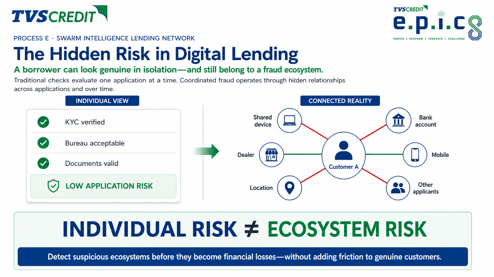
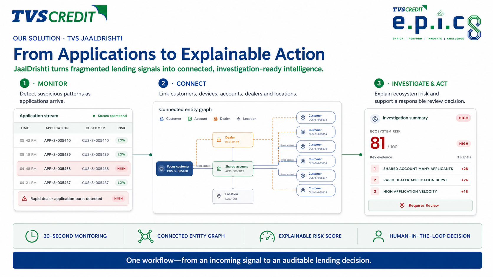
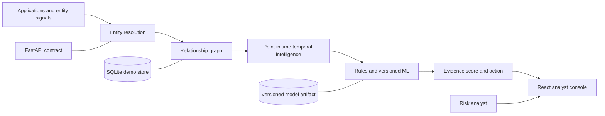

# TVS JaalDrishti

> **Detect the network before it becomes the loss.**

**TVS Credit EPIC 8 · Process E — Swarm Intelligence Lending Network**

[](https://jaal-drishti.vercel.app/demo)
[](https://github.com/Kumaryan12/jaal_dhristhi/actions/workflows/ci.yml)

<p align="center">
  
</p>

JaalDrishti is an AI-assisted, explainable ecosystem-risk intelligence layer for digital lending. It reveals relationships that an application-by-application assessment cannot see—across customers, devices, bank accounts, dealers, locations, and time—then gives a risk analyst traceable evidence and a responsible next action.

> **Individual risk ≠ ecosystem risk.** A borrower can look genuine in isolation and still belong to a coordinated, rapidly emerging network.

## Judge this project in 90 seconds

1. Open the **[Simulation Lab](https://jaal-drishti.vercel.app/demo)** and select **Presentation view**.
2. Select **Start Simulation** to run a fresh, isolated scenario.
3. Watch Customer A move from **0.00 LOW** to **85.43 HIGH** as five connected applicants emerge around a shared device and dealer inside two hours.
4. Inspect the relationship graph, ranked evidence, and human-authorized enhanced-verification action.

The transition is returned by the simulation API, not calculated in the browser. Every run receives a separate scenario namespace and leaves the active portfolio unchanged.

For the complete narration, use the **[three-minute judge presentation guide](docs/judge-presentation-guide.md)**.

## The problem

Traditional lending checks focus on the applicant in front of them: KYC, bureau score, income, documents, and repayment history. Coordinated risk often exists **between** otherwise plausible applications:

- several applicants reuse the same device or repayment account;
- applications concentrate around one dealer or location;
- identity signals overlap across a growing network; and
- activity accelerates inside a short time window.

A row-based system can approve each application independently while missing the ecosystem forming around it. By the time repayment behaviour confirms the pattern, the exposure may already be distributed across many connected loans.

## The solution

JaalDrishti continuously converts fragmented lending events into a time-aware relationship graph. It combines deterministic entity resolution, graph analytics, temporal intelligence, explainable policy rules, and a versioned ML probability to produce:

- a bounded **0–100 ecosystem risk score**;
- a navigable customer–device–account–dealer–location graph;
- ranked, machine-readable evidence with entity IDs, observed values, thresholds, and time windows; and
- one of three responsible actions: standard processing, manual review, or enhanced verification.

JaalDrishti is an intelligence and decision-support layer. It complements an LOS/LMS; it does not replace the lending system, make an autonomous rejection, or label a customer as fraudulent.

<p align="center">
  
</p>

## How the intelligence works

| Stage | What JaalDrishti does | Judge-visible output |
|---|---|---|
| **1. Observe** | Ingests applications and their device, account, dealer, location, and event-time identifiers | Live application stream |
| **2. Resolve** | Converts repeated identifiers into typed, weighted relationships without merging distinct customers | Shared-entity signals |
| **3. Connect** | Builds a heterogeneous graph and the relevant customer projection | Interactive evidence map |
| **4. Detect** | Measures network size, density, centrality, bursts, velocity, growth, and recency at the correct point in time | Emerging ecosystem alerts |
| **5. Explain** | Combines policy evidence with a versioned ML probability and ranks the contributing signals | Risk score and evidence cards |
| **6. Decide** | Maps the assessment to a review action while retaining human authority | Auditable recommendation |

## What makes it different

| Conventional application screening | TVS JaalDrishti |
|---|---|
| Evaluates one application | Evaluates the connected ecosystem |
| Sees static fields | Sees relationships and how they evolve over time |
| Treats shared infrastructure as isolated attributes | Measures shared-entity concentration and network growth |
| Produces a score with limited context | Returns ranked evidence and the involved entities |
| Risks opaque automation | Keeps the final lending action human-authorized |

## Working product

The analyst console contains six connected workspaces:

| Route | Workspace | Purpose |
|---|---|---|
| [`/`](https://jaal-drishti.vercel.app/) | **Live Monitor** | Follow the 30-second hosted event replay, select an application, and inspect its ecosystem |
| [`/investigate`](https://jaal-drishti.vercel.app/investigate) | **Investigations** | Compare the borrower profile with connected evidence and review the recommended action |
| [`/network`](https://jaal-drishti.vercel.app/network) | **Network Intelligence** | Explore a bounded, draggable, relationship-aware entity graph |
| [`/dealers`](https://jaal-drishti.vercel.app/dealers) | **Dealer Intelligence** | Inspect concentration, exposure, and dealer-level risk indicators |
| [`/analytics`](https://jaal-drishti.vercel.app/analytics) | **Portfolio Insights** | Review risk distribution, temporal movement, clusters, and exposure |
| [`/demo`](https://jaal-drishti.vercel.app/demo) | **Simulation Lab** | Run the isolated LOW-to-HIGH emerging-ecosystem demonstration |

### Ready-made investigation cases

| Application | Demonstrates | Expected level |
|---|---|---|
| `APP-S-005001` | Eight applicants reuse one device | HIGH |
| `APP-S-005013` | Shared account combined with rapid activity | HIGH |
| `APP-S-005021` | Five applications through one dealer | HIGH |
| `APP-S-005024` | Overlapping device and account signals | HIGH |
| `APP-N-000031` | Clean comparison application | LOW |

Use the corresponding `CUS-*` identifier on the Network Intelligence page—for example, `CUS-S-005013`.

## System architecture



Authoritative risk calculations remain in the backend. The browser is a typed visualization client and never reconstructs a score. The modular boundaries allow SQLite, in-memory NetworkX, and local artifacts to be replaced with enterprise storage, graph infrastructure, and a governed model registry without changing the public contract.

Read the detailed [system architecture](docs/architecture.md), [data model](docs/data-model.md), and [API contract](docs/api-contract.md).

## AI and evidence design

The production-style prototype uses a hybrid approach:

- **Entity resolution:** deterministic matching for the normalized synthetic identifiers;
- **Graph intelligence:** NetworkX features including linked applicants, component size, centrality, density, community, and connection strength;
- **Temporal intelligence:** leakage-safe rolling features for velocity, bursts, recency, and network growth;
- **Explainable rules:** versioned policy signals that remain visible to an analyst; and
- **Machine learning:** Random Forest, XGBoost, and Isolation Forest are evaluated, with XGBoost selected by validation PR-AUC for the bundled artifact.

On the deterministic synthetic benchmark, the selected XGBoost model reached **0.9949 test PR-AUC**, **0.9843 precision**, and **0.9690 recall**. These results validate the implementation against generated ground truth; they are **not** claims of production fraud performance. See the versioned [training summary](models/ml-training-summary.json).

## Reproducible evidence

The standard seed (`2026`) produces:

| Evidence | Verified value |
|---|---:|
| Total applications | 5,588 |
| Normal applications | 5,000 |
| Suspicious ecosystems | 100 |
| Suspicious applications | 588 |
| Pattern families | 4 |
| Backend and cross-layer tests | 64 passing |
| Frontend tests | 23 passing |

The four generated pattern families are shared-device rings, shared-account rings, dealer bursts, and mixed-identity rings. Dataset manifests include the seed, generator version, row counts, and SHA-256 hashes so the portfolio can be regenerated and audited.

## Technology

- **Frontend:** React 19, TypeScript, Next.js/Vinext, Tailwind CSS, React Flow, Recharts
- **Backend:** Python 3.11, FastAPI, Pydantic, SQLite
- **Intelligence:** NetworkX, scikit-learn, XGBoost, Isolation Forest
- **Quality:** Ruff, unittest, Vitest, Testing Library, GitHub Actions
- **Deployment:** Vercel frontend and API-compatible hosted handlers; Dockerized FastAPI backend

## Run locally

### Prerequisites

- Python 3.11+
- Node.js 22.13+
- npm

### 1. Start the intelligence API

```bash
python3 -m venv .venv
.venv/bin/python -m pip install -e 'backend[ml-xgboost,test]'
.venv/bin/jaal-api --host 127.0.0.1 --port 8000
```

The API will be available at:

- health: `http://127.0.0.1:8000/health`
- interactive OpenAPI: `http://127.0.0.1:8000/docs`

### 2. Generate the standard portfolio

In another terminal:

```bash
curl -X POST http://127.0.0.1:8000/api/v1/generate_demo_data \
  -H 'Content-Type: application/json' \
  -d '{
    "seed": 2026,
    "normal_application_count": 5000,
    "suspicious_ecosystem_count": 100,
    "replace_existing": true
  }'
```

### 3. Start the analyst console

```bash
cd frontend
cp .env.example .env.local
npm install
npm run dev
```

Open `http://localhost:3000`. Set `NEXT_PUBLIC_API_BASE_URL` in `frontend/.env.local` when the API runs elsewhere.

## API surface

| Method | Path | Purpose |
|---|---|---|
| `GET` | `/health` | Service and dataset readiness |
| `POST` | `/api/v1/generate_demo_data` | Generate and persist a seeded portfolio |
| `POST` | `/api/v1/analyse` | Analyse or refresh an application |
| `GET` | `/api/v1/risk_score/{application_id}` | Retrieve its stored ecosystem score |
| `GET` | `/api/v1/network/{customer_id}` | Retrieve a bounded relationship projection |
| `GET` | `/api/v1/explanation/{application_id}` | Retrieve profile, evidence, versions, and action |
| `GET` | `/api/v1/monitor/activity` | Retrieve recent scored activity |
| `GET` | `/api/v1/dashboard/summary` | Retrieve executive metrics |
| `GET` | `/api/v1/analytics` | Retrieve bounded portfolio analytics |
| `POST` | `/api/v1/demo/simulate` | Compute an isolated emerging-risk scenario |

## Verification

```bash
# Backend and cross-layer checks
PYTHONPATH=backend .venv/bin/ruff check backend tests
PYTHONPATH=backend .venv/bin/python -m compileall -q backend/app tests
PYTHONPATH=backend .venv/bin/python -W error::ResourceWarning \
  -m unittest discover -s tests -v

# Frontend checks
cd frontend
npm run lint
npm test
npm run build
npm audit --audit-level=high
```

Every push and pull request runs the same release checks in GitHub Actions. The [test-case catalog](docs/test-cases.md) maps automated and manual coverage to product behaviour.

## Deployment and production boundary

- **Presentation frontend:** [jaal-drishti.vercel.app](https://jaal-drishti.vercel.app)
- **Hosted health check:** [jaal-drishti.vercel.app/health](https://jaal-drishti.vercel.app/health)
- **FastAPI contract deployment:** [backend-fawn-theta-78.vercel.app](https://backend-fawn-theta-78.vercel.app)

The hosted presentation uses deterministic, same-origin API handlers so every judge-facing workflow is available without a persistent external database. Local development uses the complete FastAPI intelligence pipeline.

A production deployment would introduce governed LOS/LMS ingestion, PostgreSQL, durable audit retention, object storage and a model registry, enterprise OIDC/RBAC, encryption and attribute masking, rate limiting, monitoring, and asynchronous graph/training workloads.

## Responsible-use boundary

All bundled records are synthetic. JaalDrishti provides **risk intelligence**, not a fraud verdict or an autonomous credit decision. MEDIUM and HIGH results route cases for authorized human review. Any use with real customer data requires legal, privacy, security, fairness, model-risk, and lending-policy validation.

## Documentation

- [Three-minute judge presentation guide](docs/judge-presentation-guide.md)
- [System architecture](docs/architecture.md)
- [Data model and feature contract](docs/data-model.md)
- [API contract](docs/api-contract.md)
- [Test-case catalog](docs/test-cases.md)
- [Implementation phase record](docs/phase-plan.md)

---

Built for **TVS Credit EPIC 8 — Process E** with one principle at the center:

> **See the ecosystem. Explain the risk. Keep the decision human.**
