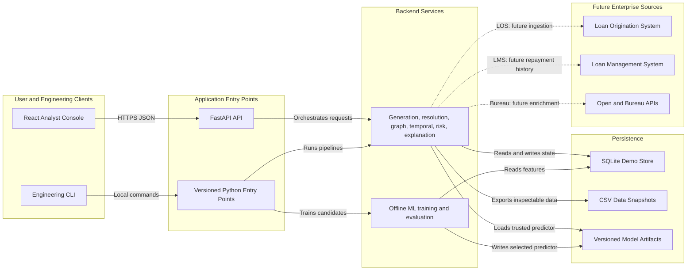

# Product and System Architecture

## Objective

JaalDrishti accepts lending-ecosystem records, resolves shared identities, builds a time-aware relationship graph, and returns a transparent 0–100 ecosystem risk score with evidence and a recommended action. The analyst experience must answer four questions:

1. Who is this borrower?
2. Who and what are they connected to?
3. Why does the network appear risky?
4. What should the lending team do next?

## Architecture principles

- **Intelligence layer, not system of record:** integrate beside an existing LOS/LMS through APIs and batch ingestion.
- **Explainability first:** every score is accompanied by traceable signals, source entity identifiers, and human-readable reasons.
- **Deterministic demo:** seeded generation and versioned scoring configuration make judging and tests repeatable.
- **No hardcoded outcomes:** the dashboard renders API results derived from stored records and computed features.
- **Modular monolith for the prototype:** one deployable backend reduces operational overhead while strict domain boundaries preserve a path to services.
- **Privacy by design:** use synthetic records and opaque identifiers now; require masking and field-level authorization before real-data integration.

## Implemented system context



The HTTP response travels back through FastAPI to the console; the arrows above focus on the forward processing and persistence paths.

## Component decisions

### React analyst console

The frontend provides six connected workspaces: Live Monitor, Investigations, Network Intelligence, Dealer Intelligence, Portfolio Insights, and Simulation Lab. React Flow renders operational and investigative entity networks; charts and tables display risk distribution, temporal trends, dealer concentration, and exposure. The Simulation Lab's **Start Simulation** action shows a computed before/after scenario through five visible processing stages.

**Why:** React and TypeScript provide a productive, strongly typed UI stack. Tailwind supports a consistent TVS-inspired blue/green/white system without a large component dependency. The browser never calculates authoritative risk.

### FastAPI API layer

FastAPI owns validation, request correlation, error mapping, OpenAPI documentation, and orchestration. Pydantic schemas are the single source of truth for request/response shapes.

**Why:** it aligns with the Python intelligence stack and produces interactive API documentation automatically. Routes are versioned under `/api/v1`; `/health` remains unversioned for deployment probes.

### Data generation and ingestion

A seeded synthetic generator creates at least 5,000 normal applications and 100 labelled suspicious ecosystems. It writes normalized records to SQLite and inspectable CSV snapshots. Scenario manifests record the seed, counts, and generator version.

**Why:** seeded, normalized data is reproducible and testable. SQLite creates a one-command local demo; repository interfaces isolate it from domain logic.

### Entity resolution

Entity resolution converts normalized ownership/usage records into typed entity links such as customer–device and customer–account. Exact synthetic identifiers are resolved deterministically first. A connection-strength calculator aggregates shared entities without merging distinct customers.

**Why:** the product seeks hidden relationships, so relationship discovery is kept separate from risk scoring. A later probabilistic matcher can be added behind the same interface when noisy real identifiers exist.

### Graph intelligence

NetworkX builds an in-memory heterogeneous graph and a derived customer projection. It calculates degree centrality, linked-applicant count, component size, shared-identity signals, density, and community membership.

**Why:** NetworkX is transparent and sufficient for the prototype volume. Graph construction is deterministic and feature computations can be unit tested independently.

### Temporal intelligence

The temporal module applies rolling windows to application timestamps, measuring application velocity, dealer/device bursts, network growth, and recency-weighted activity. Windows and thresholds are configuration, not UI constants.

**Why:** shared infrastructure is not inherently suspicious. Time concentration distinguishes common entities from an ecosystem that is rapidly forming.

### Hybrid risk scoring

The score combines rule signals, supervised model probability, and anomaly evidence through a versioned scoring policy. Rules provide guardrails and direct evidence; Random Forest supplies non-linear feature interactions; Isolation Forest provides an unsupervised comparison. XGBoost is evaluated only when installed and justified by validation results.

The public score is clamped to `[0, 100]`, with non-overlapping levels:

- LOW: `0 <= score < 40`
- MEDIUM: `40 <= score < 70`
- HIGH: `70 <= score <= 100`

**Why:** a hybrid design remains understandable during a hackathon and supports controlled ML enhancement. Model output cannot erase high-confidence graph evidence; exact weights and thresholds will be calibrated in Phase 5 rather than assumed now.

### Explainability

The explainability module converts triggered rules and feature contributions into ranked signals. Each signal includes a stable code, message, severity, contributing entity IDs, observed value, threshold, and time window. It maps risk levels to actions such as standard processing, manual review, or enhanced verification.

**Why:** an analyst must be able to verify the evidence. Stable signal codes also let an LOS/LMS integrate without parsing prose.

### Training and evaluation

Training reads a point-in-time feature table to avoid future leakage. Stratified train/validation/test splits are grouped by suspicious ecosystem so members of one generated ring cannot appear on both sides of a split. Metrics include precision, recall, F1, and PR-AUC.

**Why PR-AUC:** suspicious applications are deliberately rare. Accuracy and ROC-AUC can look strong while producing too many false positives; PR-AUC focuses evaluation on the quality of positive predictions under class imbalance.

## Primary analysis flow

1. The analyst submits an application ID.
2. The API loads the application and its customer.
3. Entity resolution finds linked devices, accounts, dealers, and location.
4. Graph analysis extracts the relevant connected component and graph features.
5. Temporal analysis calculates point-in-time velocity and growth features.
6. The scoring policy combines rules, model probability, and anomaly evidence.
7. Explainability ranks evidence and assigns a recommended action.
8. The API persists the versioned result and returns the score, signals, profile, and graph summary.

All feature queries use the application timestamp as their cutoff during training and historical analysis to prevent look-ahead leakage.

## Implemented repository structure

```text
TVS-JaalDrishti/
├── backend/
│   ├── app/
│   │   ├── api/                 # Thin HTTP routes and orchestration
│   │   ├── core/                # Settings, errors, request IDs
│   │   ├── repositories/        # SQLite persistence adapter
│   │   ├── schemas/             # Pydantic API contracts
│   │   └── services/            # Generation, resolution, graph, temporal, risk, ML, demo
│   ├── scripts/                 # Generation/training entry points
│   └── pyproject.toml
├── frontend/
│   ├── app/                     # Five Vinext/React routes and metadata
│   ├── components/              # Shell, shared UI, network explorer
│   ├── lib/                     # Typed API client and contracts
│   ├── tests/                   # Vitest and Testing Library tests
│   ├── public/                  # Favicon and social preview
│   └── package.json
├── data/
│   ├── raw/                     # Generated normalized CSV snapshots
│   ├── processed/               # Point-in-time feature datasets
│   └── README.md                # Data dictionary and generation metadata
├── models/                      # Versioned local demo artifacts/metrics
├── docs/                        # Architecture, API, decisions, screenshots
├── tests/
│   ├── backend/                 # Unit, contract, integration tests
│   ├── frontend/                # Component and accessibility tests
│   └── e2e/                     # Critical analyst/demo journeys
├── docker-compose.yml
└── README.md
```

Generated databases, bulk CSV rows, model binaries, caches, and secrets will not be committed. Small deterministic fixtures and metrics reports will be committed.

## Deployment topology

Locally, the Vinext frontend runs on port 3000 and calls the FastAPI service on port 8000. Docker Compose packages the backend with a persistent SQLite volume and a read-only model mount. The frontend is built as a Cloudflare Worker-compatible Sites deployment. GitHub Actions runs Python lint/compilation/tests plus frontend lint/tests/build/audit on every push and pull request.

For an enterprise deployment, use separate frontend and API workloads, PostgreSQL for transactional data, object storage for snapshots/artifacts, Redis for caching, and background workers for ingestion/training. Authentication can be delegated to corporate OIDC, with role-based analyst/auditor/admin access.

## Scalability path

| Prototype boundary | Scale-out replacement | Trigger |
|---|---|---|
| SQLite repository | PostgreSQL | Concurrent writers or enterprise retention |
| In-memory NetworkX graph | Neo4j, Memgraph, or graph projection jobs | Graph no longer fits memory or traversal latency misses SLO |
| Synchronous analysis | Queue plus stateless workers | Large batch ingestion or analysis exceeds request budget |
| Local model artifact | Object store plus model registry | Multiple environments, approvals, or rollback requirements |
| Process-local cache | Redis | Multiple API replicas or repeated network traversals |
| CSV ingestion | Event/batch connectors with schema registry | Production LOS/LMS integration |

Repository and service interfaces keep these replacements outside scoring and API contracts.

## Security and governance

- Synthetic-only demo data is clearly labelled in every generated manifest.
- Input schemas reject unknown or malformed identifiers and bound graph traversal depth.
- Requests use correlation IDs; logs avoid raw payloads and exception details; secrets come from environment configuration.
- Each analysis records data snapshot, feature schema, model version, rule-policy version, and timestamp.
- Recommendations remain decision support: the response states that final credit action requires authorized human or policy review.

## Non-functional targets for the demo

- A seeded full dataset generates locally in under 60 seconds on a typical laptop.
- A single cached application analysis returns in under 500 ms; uncached analysis targets under 2 seconds.
- Core intelligence modules achieve at least 80% branch coverage.
- The dashboard is usable at 1280 px and responsive down to 375 px.
- Text and controls target WCAG 2.1 AA contrast and keyboard operation.

These are engineering targets, not claims, until measured in later phases.

## Decisions requiring approval

1. Use a modular FastAPI monolith with replaceable domain/repository boundaries.
2. Use SQLite plus inspectable CSV snapshots for the self-contained prototype.
3. Use NetworkX in memory rather than adding a graph database to the demo.
4. Use deterministic exact entity links for synthetic data; defer probabilistic identity matching.
5. Use hybrid, versioned explainable scoring with ML as supporting evidence.
6. Keep authoritative calculations in the backend; the React UI is a typed visualization client.
